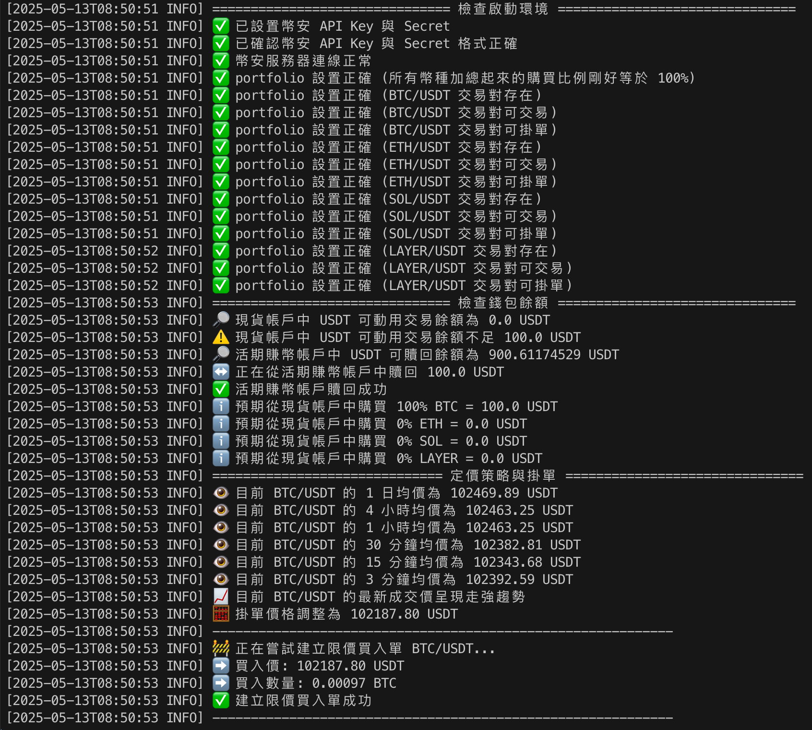
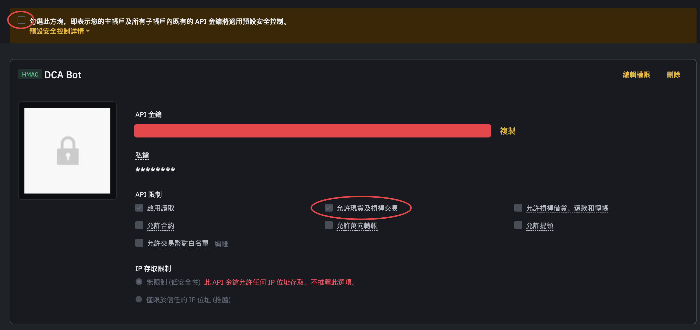

# Binance DCA

[](https://github.com/astral-sh/uv)
[](https://github.com/astral-sh/ruff)

[](https://github.com/pre-commit/pre-commit)

Binance DCA 自動定投腳本。



## 特點 (Features)

1. 繞過幣安內建的現貨 DCA 機器人的高額服務費 (2%)
2. POST Only 掛單，確保交易手續費是最低費率 (0.1% -> 0.075%)
3. 動態定價策略 (不會被做市商多扒一層皮)
4. 現貨帳戶餘額不足，自動從活期賺幣贖回資產進行定投買入。

## 設置方式

1. 在[幣安 API 管理頁面](https://www.binance.com/zh-TC/my/settings/api-management)建立 API Key

確保勾選了**允許現貨及槓桿交易**，如下所示。



2. 編輯 [.env.example](https://github.com/finn79426/Binance-DCA/blob/main/.env.example)，將 API 金鑰與私鑰放進去，並將檔案重新命名為: **.env**。

```
BINANCE_API_KEY="API金鑰"
BINANCE_SECRET_KEY="API私鑰"
```

3. 編輯 [config.json](config.json)，設置定期定額買入投資組合。

1. 所有投資組合比例的總和不可超過 100%。
2. 必須確保存在 quote 交易對。建議將 quote 維持預設值 `USDT` 即可 (即: `BTC/USDT` 是一個合法的交易對)
3. `amount` 為每次掛單的 `quote` 花費量。

- 請參考以下範例。

```json=
{
    "portfolio": {
        "BTC": 50,  // 每輪定投買入 500u
        "ETH": 30,  // 每輪定投買入 300u
        "SOL": 10,  // 每輪定投買入 100u
        "LAYER": 10 // 每輪定投買入 100u
    },
    "quote": "USDT",
    "amount": 1000
}
```

4. 確保現貨帳戶或活期賺幣帳戶有足夠的 `quote` 資產餘額。

- 當現貨帳戶可動用資金不足以涵蓋本輪定投購買
- 腳本會嘗試從活期賺幣帳戶贖回 `quote` 資產。
- 如果活期賺幣帳戶的餘額仍不足以涵蓋本輪定投，則腳本退出執行。

5. 設置排程執行程式。


